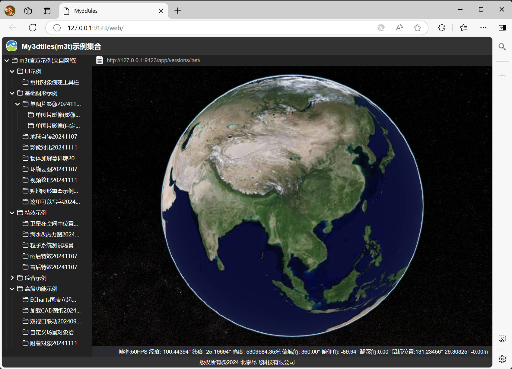
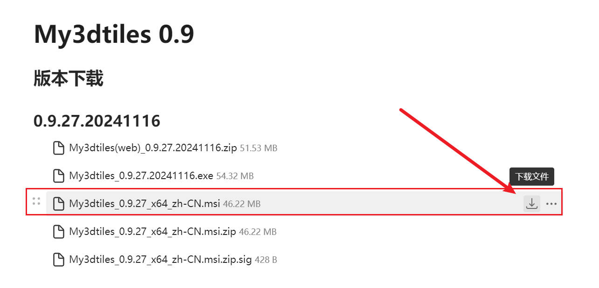
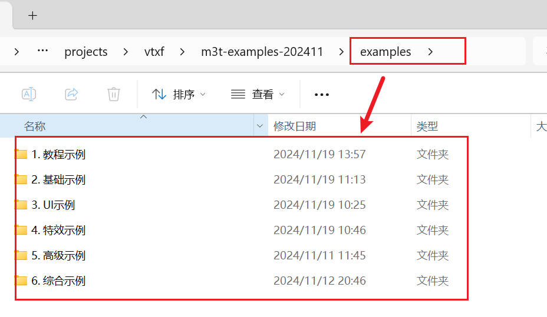
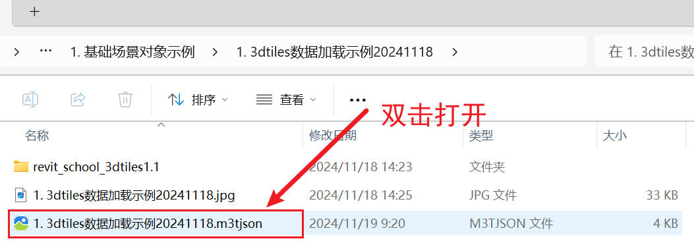

# My3dtiles示例代码

## 1 简介



My3dtiles(简称m3t)是一个3dtiles数据浏览器，快速数字孪生搭建工具。M3T官网地址：https://czmtoy.com/p/my3dtiles/。

M3T示例代码，旨在展示通过M3T快速搭建的三维场景。M3T是一个桌面工具，但是搭建的场景是可以直接在网页上展示的。只需要将M3T生成的场景文件(m3tjson)，放到服务器上，通过浏览器访问即可。

M3T示例代码的官网地址：https://p.czmtoy.com/m3t/examples/web/

备用地址：http://114.242.26.126:7000/examples/web/

## 2 使用说明

查看示例场景的方式有两种：在浏览器中查看示例场景，或者在My3dtiles桌面程序中查看示例。

### 2.1 在浏览器中查看示例

浏览器中查看示例，需要首先在本地运行http服务器，您可以通过以下两种方式来运行http服务器。

#### 2.1.1 命令行模式
1. 安装nodejs
2. 安装依赖
   ```bash
   npm install
   ```
3. 执行命令
   ```bash
   npm start
   ```
4. 在浏览器中打开  
   http://127.0.0.1:9123/web/

#### 2.1.2 图形界面模式
1. 下载简易http服务器  
    可以在以下网址下载 http-server-vtxf20221104.exe  
    https://www.wolai.com/vtxf/p7eukvsNuwWEVNmR8m4KYw  
2. 将此文件放到M3T示例代码的根目录下
3. 双击运行http-server-vtxf20221104.exe
4. 在浏览器中打开
   http://127.0.0.1:9123/web/

### 2.2 在My3dtiles桌面程序中查看示例

需要首先安装My3dtiles软件，安装地址在这里：
https://www.wolai.com/vtxf/85sBNQP1KsdkFSrtbRGPyG

msi文件是安装文件，如下图所示


安装好以后，打开examples文件夹。


双击其中的任意m3tjson文件，即可打开相应的场景


## 3 m3tjson场景文件的说明
使用My3dtiles搭建数字孪生场景以后，可以将搭建好的场景保存成m3tjson文件，以后双击即可再次访问该场景。
把m3tjson文件放到http服务器上去以后，就可以通过浏览器访问相应的网址打开场景。

## 4 后续问题

### 如有问题，请加入群聊

#### 微信群

微信群请点击链接加入：  
[微信群](https://www.wolai.com/vtxf/8EMB7QXDBWxhTTNubw7xyP)  
https://www.wolai.com/vtxf/8EMB7QXDBWxhTTNubw7xyP  

#### QQ群

点击直接加入QQ群聊：  
https://qm.qq.com/q/kcmepspADC

或者扫描二维码加入QQ群聊：  


#### gitee地址
https://gitee.com/vtxf3d/my3dtiles-examples

#### github地址
https://github.com/vtxf/my3dtiles-examples


